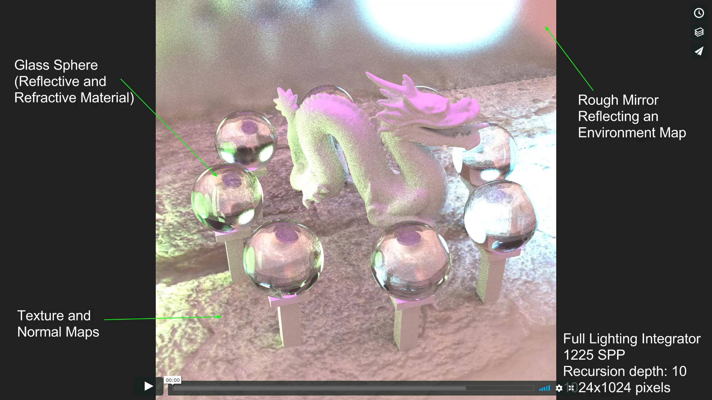
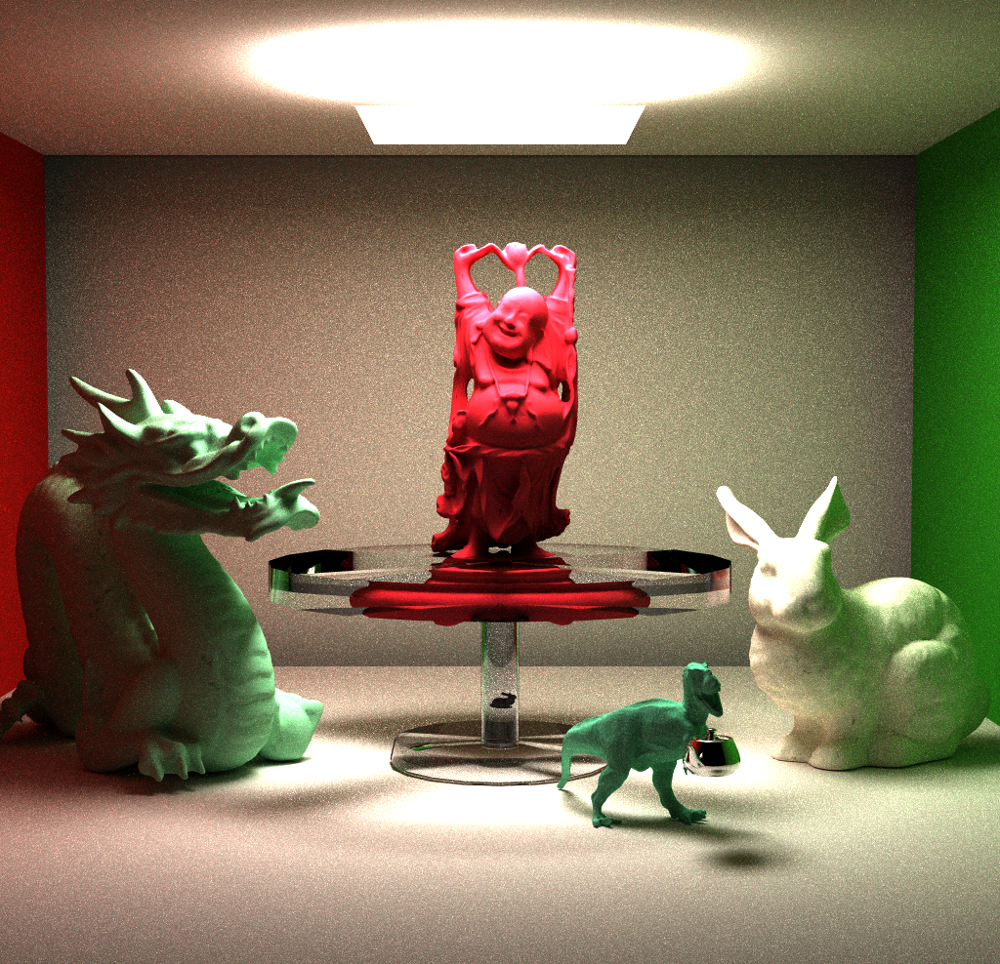
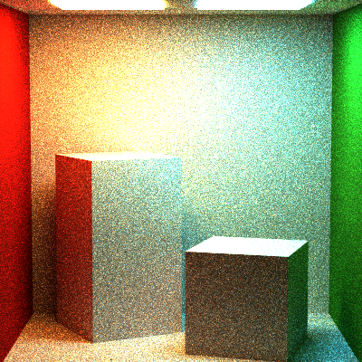
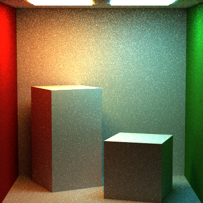

CPU Monte Carlo Path Tracer
===========================

* Name: Aman Sachan
* Built from scratch for CIS 561: Advanced Computer Graphics at the Universoty of Pennsylvania

------------

## Introduction
  
Monte Carlo Path tracing is a rendering technique that aims to represent global illumination as accurately as possible with respect to reality. The algorithm does this by approximating the integral over all the illuminance arriving at a point in the scene. A portion of this illuminance will go towards the viewpoint camera, and this portion of illuminance is determined by a surface reflectance function (BRDF). This integration procedure is repeated for every pixel in the output image. When combined with physically accurate models of surfaces, accurate models light sources, and optically-correct cameras, path tracing can produce still images that are indistinguishable from photographs.

Path tracing naturally simulates many effects that have to be added as special cases for other methods (such as ray tracing or scanline rendering); these effects include soft shadows, depth of field, motion blur, caustics, ambient occlusion, and indirect lighting, etc.

Due to its accuracy and unbiased nature, path tracing is used to generate reference images when testing the quality of other rendering algorithms. In order to get high quality images from path tracing, a large number of rays must be traced to avoid visible noisy artifacts.

## Features Implemented:

### Full Lighting Integrator

This integration scheme renders the scene based upon the Light Transport Equation but takes into account Multiple Important Sampling, Russian Roullete Termination, Conditionals for various types of light sources, and is implemented in an iterative rather than recursive manner. All these features let it avoid blown out images that can occur in the naive integrator, keep global illumination, terminate rays early with very little impact on the render quality, etc. These features introduce bias into the render but in a way that is barely noticeable so that renders still look realistic. The bias is hard to notice because it is mimicking  but approximating how light would actually bounce around and react in the scene; for example cosine weighted sampling introduces bias but is essentially just lamberts law in action. 

### Multiple Important Sampling (MIS)

 

_over blown image due to a lack of MIS_

_energy in the image is corrected with MIS_

The path tracer introduces different biases for different scenes, to help make each of those scenes converge faster without deviating too much from the ground truth. These biases include light important sampling, BSDF important sampling, consine weighted sampling, etc. Instead of relying on anyone of these biased forms of sampling we get the best result across all kinds of scenes by taking a weighted average of them. The technique that does this is called Mulitple Important Sampling.

Without Multiple Importance Sampling, renders can look blown out or seem very dark because the changes in energy arent correctly accounted for.

The color at every point in the scene is correctly scaled via Multiple Important Sampling by accounting for the contribution of each incoming ray at that point with respect to the actual energy that the light rays bring in. 

### Volumetric Integrator

The Volumetric Integrator is just the Full Lighting but supports volumetric rendering of homogeneous media. A separate integrator had to be made because, I implemented volumetric rendering using ray marching.

Homogeneous media is interesting to model because there are multiple ways to approach it. More realistic techniques include multiple scattering, easier techniques involve single scattering, and then there is ray marching which doesnt involve scattering the ray through the medium but rather evaluating the amount of light at each step of the ray march. 

Raymarching makes the integrator slow because of all these extra evaluations for each ray. It also makes the render quality dependent upon the size of the ray march step. It also increases the variance in the scene. So, why would I use raymarching? Its the simplest to implement.

There is an improved way to ray march which uses varying step sizes decided by the angular steps. Its called "Equiangular Sampling". Essentially, you vary the step size in accordance to the angular spread of the light you are important sampling. This way the raymarched points are spread out according to how they are lit (i.e. according to the energy that they recieve). Equiangular sampling reduces the high variance that can appear in ray marched scenes.

Switching back to Volumetric Media, they are defined by 4 terms that define how they interact with light. These terms are: 

* __In-scattering:__ How much light is scattered back into the medium, at some point in the medium.
* __Out-scattering:__ How much light is scattered out of the medium, at some point in the medium.
* __Absorption:__ How much light is absorbed at some point in the medium.
* __Emission:__ How much light is emitted at some point in the medium. 

For heterogeneous media these properties are defined and vary at every point in the medium, whereas homogeneous media have the same value for each of these properties at every point in the medium.

At some point, I'd like to come back and properly tackle the complexity of volumetric media in a better manner.

### Bounding Volume Hierarchy (BVH)

A BVH is a spatial acceleration structure that is super useful in path tracing. Without a BVH during the intersection testing stage, every ray would have to iterate over every single primitive in the scene to determine if it intersects with them or not. As your scene complexity increases this becomes an incredibly arduous task. 

A BVH alleviates a whole bunch of these intersection tests by culling out the ones that definitly wont happen. A BVH takes all your primitives and arranges them in a possibly multi-branched tree. Each node of the tree has a bounding box that encapsulates all the nodes that are below it. The ray now performs intersection tests with the bounding boxes of the nodes. The leaf nodes actually contain primitves. The ray is essentially using bounding boxes as a filter and goes back to intersection testing with primitives if the node contains primitives. This way a ray initially tests against the entire scenes bounding box, assuming the ray is entering the scene, in the next intersection test the ray can disregard 50% or more of the primitves in the scene (if the number of branches in the tree is greater than 2, then at every level the tree disregards ((n-1)/n)% of the primitives in the scenes). All of this assumes we made a balanced BVH tree ofcourse.

#### BVH results:

At 5k triangles                                                                                                                               
With BVH at 1 sample/pixel: 4594 milliseconds                                                                                                 
Without BVH at 1 sample/pixel: 454041 milliseconds                                                                                            
Render Time Sped up 98.83347 times (or 9883.347% speed increase)                                                                              
BVH Construction Time For Wahoo.obj: 156 milliseconds

### Multi Threading

A path tracer is one of the most obvious applications for multi-threading. Every ray that bounces around in the scene is independent of all the other rays in the scene. The improvements in speed I got from multi-threading aren't documented because a non-multi-threaded version would take atleast 100 times longer, probably more, but I couldn't leave my laptop running for even a solid day to make this comparison as my other classes demanded my laptop as well.

### Various BSDFs (Materials)

* __Microfacet BRDF:__ This BRDF mimics reflection by a material as if it was rough on a microscopic scale, so like most objects in the real world. Microfacet models allow us to make materials have a roughness parameter.
* __Transmissive BTDF:__ This BSDF models the refraction of light through transmissive media, which leads interesting to caustics.
* __Glass BSDF:__ Glass is unique as it consists of both reflective and refractive BxDFs.
* __Matte BSDF:__ Matte BSDF can be though of as more complex lambert surfaces. This complexity arises from how they can be tuned to represent plastic but can also be tuned to look like the rubbery matte cover on your phone.
* __Mirror BSDF:__ This material is a specular object with a roughness parameter, that comes from the microfacet BRDF, to control the reflection lobe.

### Various Lights

* __Environment Map Lights:__ These are your typical skyboxes, but each point on the image that forms the skybox acts as a light source of that color. It is possible to Important Sample the pixels within the image for better and faster convergence, but I have not implemented that.
* __Spot Lights:__ These are essentially point lights with a cone of effect. We can define the fall off and also change the spread of the cone of light.
* __Point Lights:__ These can be thought of as infinitely small sphere lights. There is a drastice fall off in energy because of the way the pdf is modelled, and so if a point light is very close to objects in the scene, a portion of the object looks blown out.
* __Diffuse Area Lights:__ Most common and easy to implement light source. It treats the shape of the light as a distribution of many point lights but without the blown out effect. 

### Direct Lighting Integrator

The Direct Lighting Integrator has no Global Illumination because it simply ignores secondary bounces of the ray once it hits something in the scene. It is a part of Full Lighting Integration as it is essentially Light Important Sampling.

### Naive Lighting Integrator

A Naive brute force approach to path tracing. This integrator takes a very long time and a very large number of samples per pixel to converge upon an image. The major difference between naive and full lighting are the biases the that full lighting integrator uses to make the image converge orders of magnitude faster at a smaller sample per pixel count.

### Complex Implicit Surfaces

If an implicit surface can be defined by an equation equating to zero, it can define by a Signed Distance Field (SDF); I used SDF's during intersection tests to determine if we're inside, outside, or actually intersecting the object. In this way, we can create primitives out of implicit surfaces that can interact with the scene in the same way all other primitives do.

### Thin Lens Camera Model

Thin Convex Camera Lenses can be mimicked by having rays shot out from the camera pass through some point sampled on the lens and then using this point to change the original ray based on the properties of the lens. The technique is just an approximation for the actual math and produces better renders with more samples/pixel. At a high level the origin of the ray is shifted to from a sampled point on the camera lens, and the ray direction is changed depending upon the focal distance and thickness of the lens.

### Power and Balance Heuristics

They are used to weight the energy contributions of rays which is handy during Multiple Important Sampling. Power and Balance Heuristics are just different rules of thumb for this weighting.

### Russian Roullete Termination

It is a technique employed to cut short the ray bounce depth once the energy being returned from the ray falls below a randomised threshold. The loss in energy is compensated by scaling up the existing energy value by an appropriate amount. When averaged over a bunch of samples, the loss in accuracy of the render is barely noticeable if at all.

### Sampling Techniques

A variety of sampling techniques were implemented for the various primitives and shapes that the path tracer deals with. All of these sampling techniques involved warping samples on a square plane to the shape in consideration. This way, I didn't have to implement a whole new sampling technique for every shape. This warping technique also allows for the introduction of biases such as cosine weighted sampling, in a controllable manner and from a common starting point.

The samples on the square plane are generated in a "stratified uniform grid", which basically means that you generate uniform points for each grid cell of the square plane and then randomly jitter the samples within the grid cell. This avoids the banding and distinct boundaries 
(think distinct bands in a shadow rather than a smooth gradient) that are a pitfall of uniform grid sampling. It also avoids the possible clumping of samples that can happen in purely randomized sampling, which can introduce unwanted bias in the image and sometimes still produce artifacts like the banding issue of uniform grid sampling.

### Intersection Testing with various primitives

The Path Tracer handles various primitives such as implicit surfaces, triangles for meshes, and the basic ones like cubes, spheres, discs, and squareplanes. Intersection testing for primitives happens in tangent space where we can greatly simplify the equations for determining an intersection, because we can guarantee things like the primitive being at the origin, facing the positive z direction, having a fixed scale 
(i.e. not being scale distorted), etc. For this reason the ray that will be used for intersection testing is transformed into tangent space for the intersection test and then converted back into world space right after.

## Reference: 

[Physically Based Rendering, Third Edition](http://www.pbrt.org/)