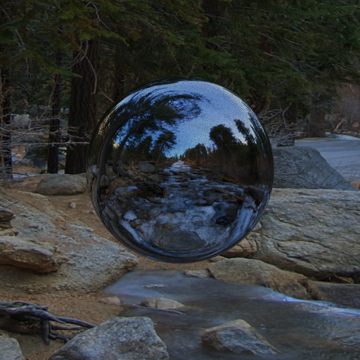
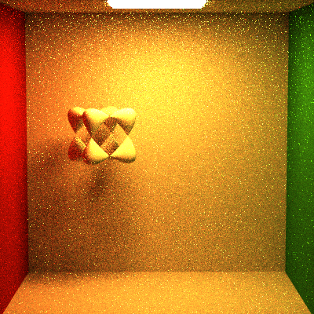
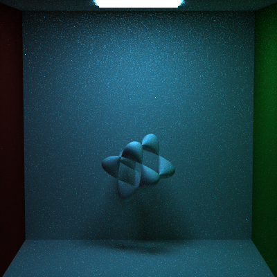
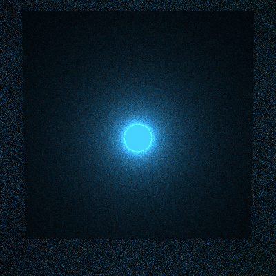
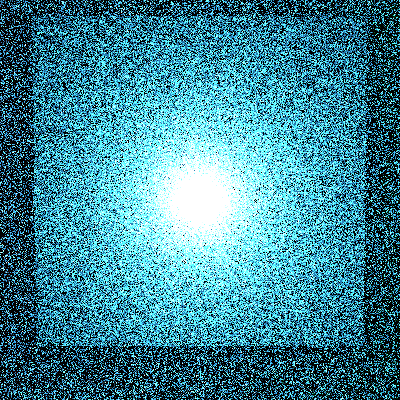
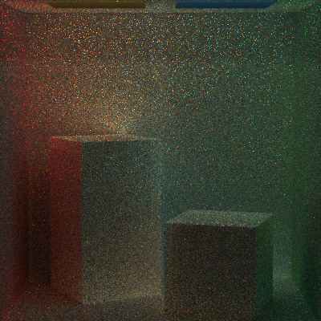
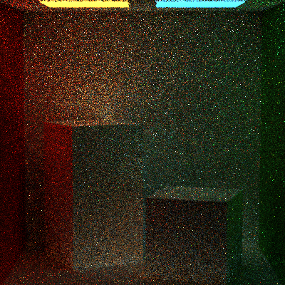
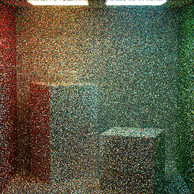

Path Tracer: Nights of the Final Project II - The Significant Parts
======================

**University of Pennsylvania, CIS 561: Advanced Computer Graphics, Final Project
Part II**

* Name: Aman Sachan
* PennKey: 20612513
------------
#README

##Extra Credit:

Implicit Surfaces
Environment Lights

## Pretty Renders:

## Environment Lighting Renders

### Frozen Waterfall: Full Lighting, 100 Samples per pixel

## Implicit Renders

### Implicit Surface: Goursat's Surface, 16 Samples per pixel

### Implicit Surface: Goursat's Surface, 100 Samples per pixel

## Volumetric Renders:

### Blue Sphere Light, Volumetric Lighting, 16 Samples per pixel, sigmaA = 0.1, sigmaS = 3.0

### Blue Sphere Light, Volumetric Lighting, 4 Samples per pixel, sigmaA = 0.1, sigmaS = 3.0

Caveat: Divided by sigmaS instead of multiplying by it

### Cornell Box with 2 Lights, Volumetric Lighting, 16 Samples per pixel, sigmaA = 0.0, sigmaS = 0.03

### Cornell Box with 2 Lights, Volumetric Lighting, 4 Samples per pixel, sigmaA = 0.3, sigmaS = 0.03

### Cornell Box with 2 Lights, Volumetric Lighting, 1 sample per pixel, sigmaA = 0.1, sigmaS = 3.0

